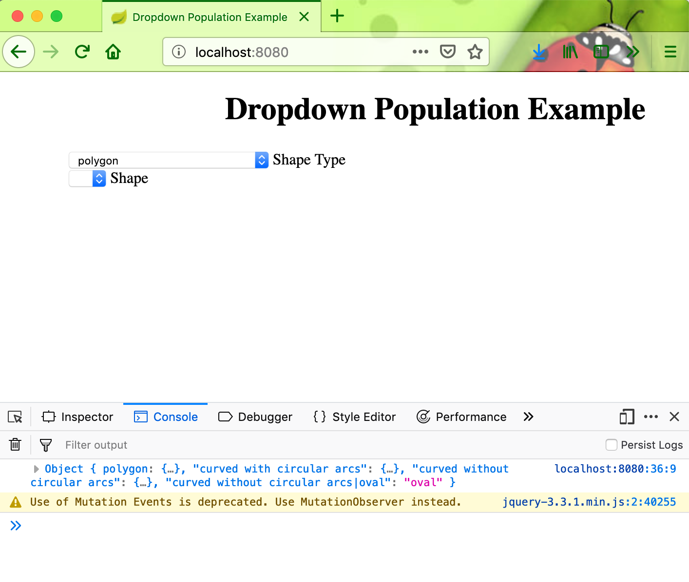
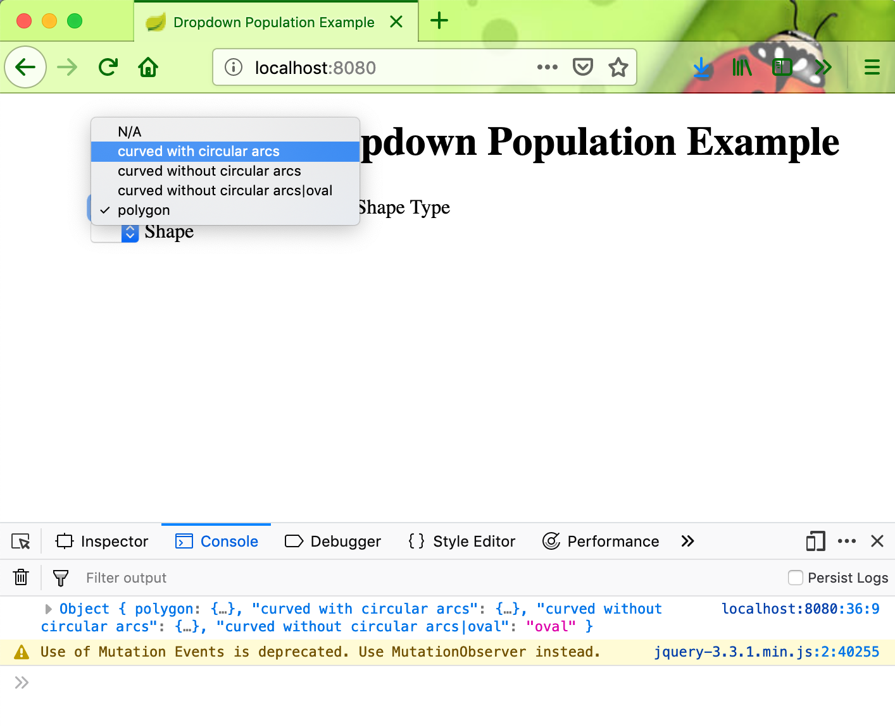
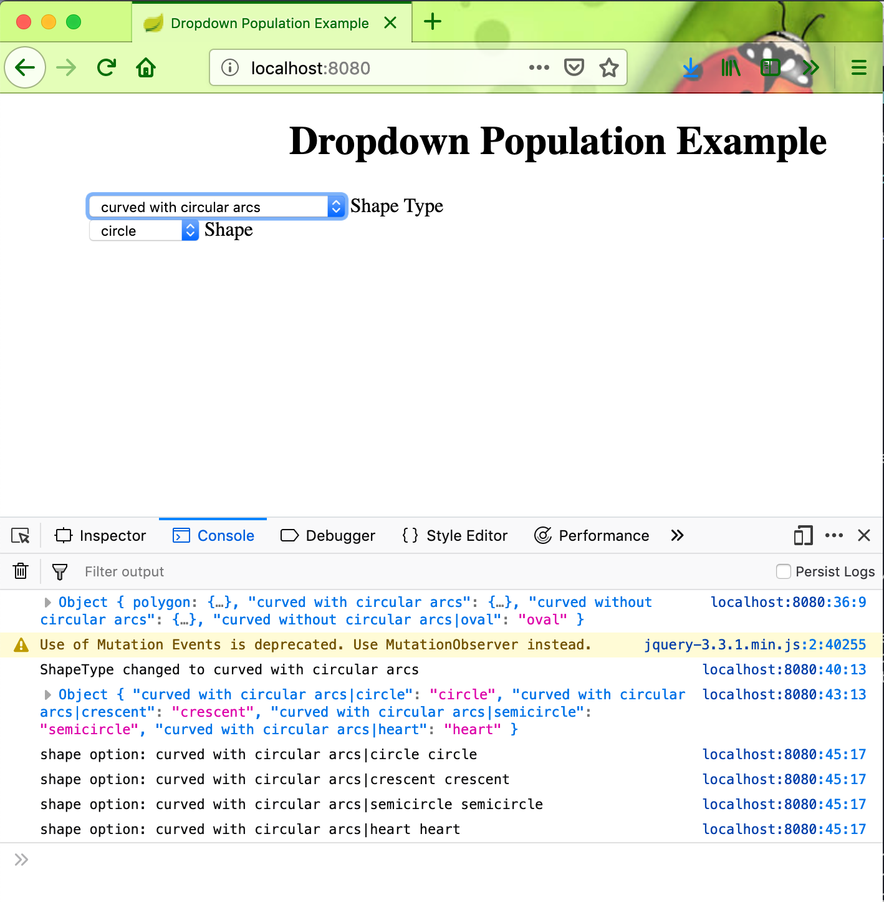

# springboot-dropdown-example

#### Run locally

```
git clone https://github.com/hendisantika/springboot-dropdown-example.git
```

```
mvn clean spring-boot:run
```

#### Screen shot

Drop Down Page





